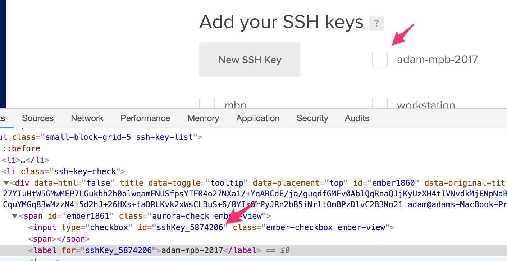

# tmate on digital ocean

## 1. Set up your api keys for DO

Get your digital ocean api keys from [here](https://cloud.digitalocean.com/account/api/tokens). Export your token as `DIGITALOCEAN_TOKEN` in your shell or provide it to Terraform when it asks.

## 2. Setup terraform

First run `terraform init`, then take a look at `variables.tf` and note which variables you might want to tweak. To get started, you should only need to add your ssh key ID from Digital Ocean into Terraform. The easiest way I've found to do this is by inspecting the element of the `Create Droplet` screen, right clicking on your SSH key name, and taking the ID from the value of the `<label>` tag. You can see this below in the screenshot:



Once you have the ID of your ssh key, create a file named `terraform.tfvars` and add the following contents:

```
ssh_keys = ["123456"]
```

### 3. Terraform apply

Now that you've got everything set up, lets try `terraform apply`. After Terraform has done it's job, you should see Terraform output the public IP of the droplet.

### 4. Get tmate config from docker container

Once the instance is up, you should be able to `ssh root@ip` and poke around. To get your tmate config, try the following from your workstation:
```
ssh root@your-droplet-ip "docker logs -f \$(docker ps  | grep tmate | awk '{ print \$1}')"
```

Or if the above doesn't work, try ssh'ing into your droplet and running:
```
docker logs -f $(docker ps  | grep tmate | awk '{ print $1}')
```
